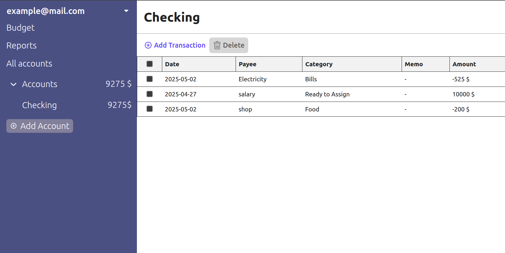
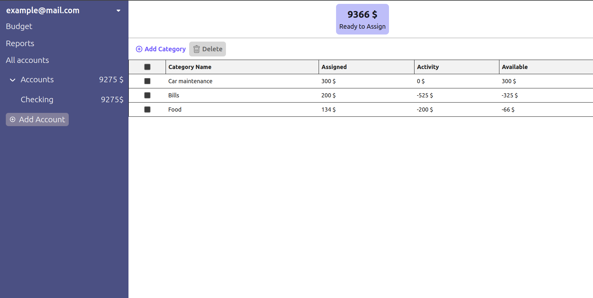

# Budgteing App

```shell
npm install
```
 
Це завантажить усі залежності.

## Building

Щоб зібрати проєкт, треба виконати:

```shell
npm run build
```

Щоб запустити сервер, треба виконати:

```shell
npm start
```






